# 第一章 需求分析

## 1.1 项目背景

### 1.1.1 行业现状分析

随着人工智能技术的飞速发展，编程教育正在经历深刻变革。传统的编程学习模式存在以下问题：

1. **学习资源碎片化**：学习者需要在多个平台之间切换，难以形成系统的知识体系
2. **实践场景缺失**：现有的学习平台主要提供代码片段练习，缺乏完整的项目实战环境
3. **个性化指导不足**：学习者的问题难以得到及时、精准的解答
4. **学习效果难以评估**：缺乏完整的学习轨迹追踪和效果评估机制

### 1.1.2 项目目标

本项目旨在构建一个**智码启行（ZCWL）编程学习平台**，实现以下核心目标：

1. **智能化学习辅助**：通过RAG技术和AI问答，为学习者提供精准的文档问答服务
2. **真实项目驱动**：引入GitHub/Gitee真实项目，让学习者在工业级代码中学习
3. **完整代码生成**：AI不仅能生成代码片段，更能生成完整的、可运行的项目
4. **全链路学习追踪**：记录学习轨迹，生成学习报告，帮助学习者了解自己的学习状况

## 1.2 功能需求

### 1.2.1 用户管理模块

| 功能         | 描述                                      |
| ------------ | ----------------------------------------- |
| 用户注册     | 用户输入用户名、邮箱、密码进行注册        |
| 用户登录     | 用户输入邮箱、密码登录，支持JWT Token认证 |
| 用户信息管理 | 查看和修改个人资料、头像等                |
| 密码安全     | BCrypt加密存储，支持账户锁定机制          |

### 1.2.2 智能文档问答学习模块

| 功能         | 描述                                  |
| ------------ | ------------------------------------- |
| 文档列表浏览 | 按分类、标签筛选文档列表              |
| 文档目录查看 | 查看文档章节结构                      |
| 文档内容阅读 | 阅读文档章节内容                      |
| AI智能问答   | 基于文档内容进行RAG问答，支持流式输出 |
| 文档评论     | 对文档章节进行评论互动                |

### 1.2.3 项目分析学习模块

| 功能           | 描述                            |
| -------------- | ------------------------------- |
| GitHub项目导入 | 输入仓库URL，自动克隆并分析项目 |
| 项目结构展示   | 生成可视化的文件树结构          |
| 技术栈提取     | 自动识别项目使用的技术栈        |
| AI项目问答     | 基于项目代码进行智能问答        |
| 学习文档生成   | 自动生成项目的学习文档          |

### 1.2.4 项目实战模块

| 功能              | 描述                                      |
| ----------------- | ----------------------------------------- |
| 前端项目生成      | 根据需求生成完整的前端项目（HTML/CSS/JS） |
| 控制台项目生成    | 生成可运行的控制台代码（Python/Java/C等） |
| 在线代码编辑      | 使用Monaco Editor提供代码编辑功能         |
| 代码实时预览      | 前端项目支持实时预览效果                  |
| WebSocket代码执行 | 支持控制台代码的在线运行和交互式输入输出  |

### 1.2.5 学习追踪模块

| 功能     | 描述                           |
| -------- | ------------------------------ |
| 学习计时 | 记录用户在文档页面的学习时长   |
| 进度保存 | 自动保存阅读进度               |
| 学习统计 | 统计累计学习时长、阅读文档数等 |
| 学习报告 | 生成学习报告卡片               |

### 1.2.6 通知消息模块

| 功能     | 描述                 |
| -------- | -------------------- |
| 通知列表 | 显示用户的通知列表   |
| 未读标记 | 显示未读通知数量徽标 |
| 通知详情 | 查看通知详细内容     |
| 标记已读 | 将通知标记为已读状态 |

## 1.3 非功能需求

### 1.3.1 性能需求

1. **响应时间**：API接口响应时间不超过200ms
2. **并发支持**：支持至少100个并发用户
3. **AI响应**：流式输出首字响应时间不超过3秒

### 1.3.2 安全需求

1. **密码安全**：使用BCrypt加密存储
2. **认证授权**：JWT Token无状态认证
3. **输入验证**：所有输入参数进行校验
4. **账户保护**：连续5次登录失败锁定账户15分钟

### 1.3.3 可用性需求

1. **系统可用性**：保证7x24小时可用
2. **数据备份**：定期备份数据库
3. **错误处理**：完善的异常处理机制

## 1.4 用例图


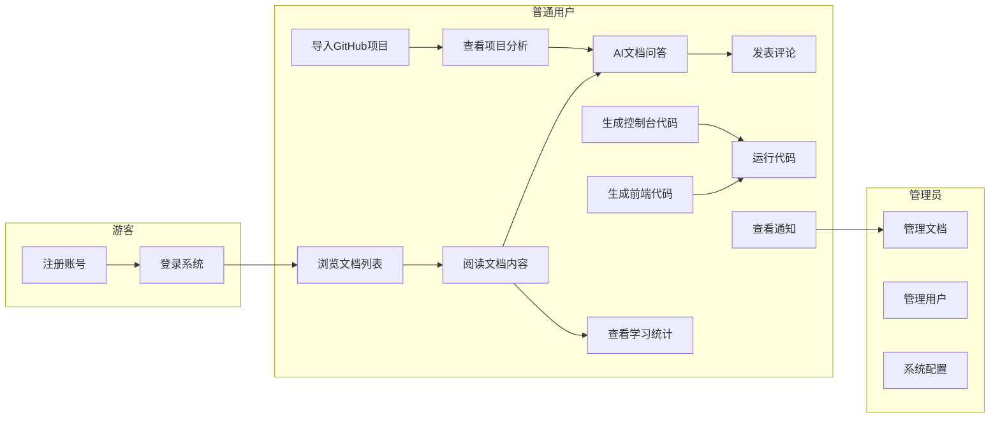

## 1.5 用户操作流程图

### 1.5.1 用户注册登录流程

用户注册登录是进入系统的第一道关口。登录时输入邮箱密码，前端发送请求，后端验证密码并检查账户锁定状态，验证通过后生成JWT Token返回。注册时填写用户名、邮箱、密码即可创建账户。

### 1.5.2 文档学习流程

用户进入文档详情页后，可按章节阅读文档内容。系统自动记录学习时长，用户可随时使用AI问答功能答疑，也可对章节发表评论与其他学习者互动。

### 1.5.3 GitHub项目导入流程

用户输入GitHub仓库URL后，系统自动克隆代码并上传至对象存储。后台异步分析项目，生成文件树结构、识别技术栈、提取关键代码片段，供用户学习和讨论。

### 1.5.4 项目实战代码生成与运行流程

用户选择代码类型（前端项目或控制台项目）和技术栈，用自然语言描述需求后AI生成完整代码。前端项目支持实时预览效果，控制台项目支持WebSocket在线运行和交互式输入输出。

### 1.5.5 学习追踪流程

系统自动记录用户进入和离开文档章节的时间，计算实际学习时长。统计用户累计学习时长、阅读文档数等数据，生成可视化的学习报告卡片。

### 1.5.6 通知消息流程

用户发表评论后，系统创建通知并实时推送。用户点击通知图标可查看列表，点击具体通知进入详情，同时标记为已读状态。

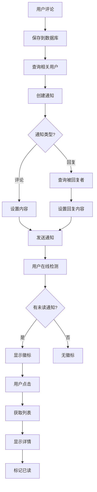

## 1.6 数据流图

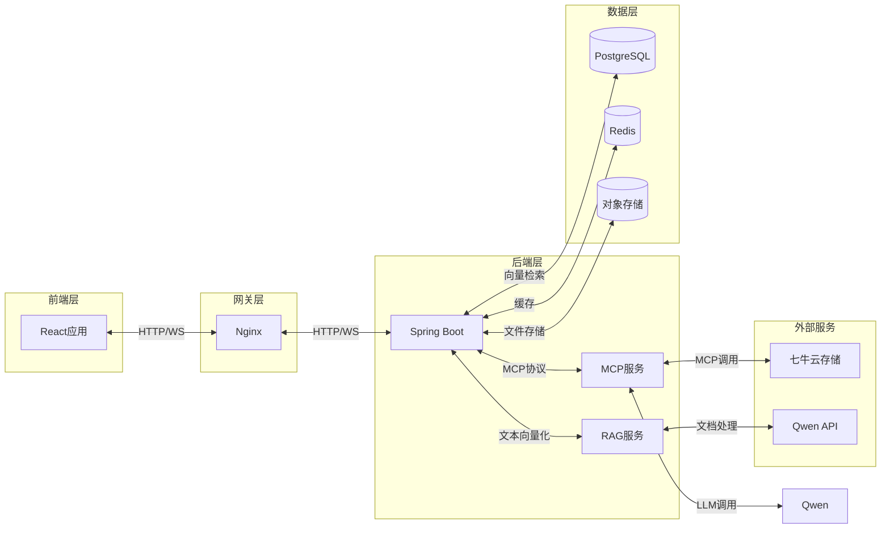

## 1.7 项目创新点

### 1.7.1 AI与教育的深度融合

本项目突破传统AI编程工具的辅助性定位，将Qwen智能体打造为不仅是问答工具，更是学习过程中的"智能导师"。

### 1.7.2 真实项目驱动学习

本项目突破传统学习平台局限于代码片段练习的局限，直接对接GitHub/Gitee真实项目库。

### 1.7.3 完整项目而非代码片段生成

本项目突破传统AI编程工具仅生成代码片段的局限，能够生成具有完整架构、多文件组织、配置管理的可运行项目。

### 1.7.4 全链路学习闭环

本项目创新性地构建"知识学习-项目分析-代码实践-成果反馈"的完整闭环。

## 1.8 术语表

| 术语      | 英文                           | 定义                                                   |
| --------- | ------------------------------ | ------------------------------------------------------ |
| RAG       | Retrieval-Augmented Generation | 检索增强生成，一种结合信息检索与语言模型生成的技术     |
| MCP       | Model Context Protocol         | 模型上下文协议，用于AI模型与外部工具服务通信的标准协议 |
| pgvector  | pgvector                       | PostgreSQL的向量扩展，支持向量存储和相似度检索         |
| JWT       | JSON Web Token                 | 一种用于身份认证的令牌格式，支持无状态认证             |
| BCrypt    | BCrypt                         | 一种基于Blowfish算法的密码哈希函数，用于安全存储密码   |
| WebSocket | WebSocket                      | 浏览器与服务器之间的全双工通信协议                     |
| Embedding | Text Embedding                 | 将文本转换为向量表示，用于语义相似度计算               |

---

# 第二章 概要设计

## 2.1 系统架构设计

### 2.1.1 整体架构图


### 2.1.2 技术架构选型

| 层级       | 技术选型                 | 说明                                      |
| ---------- | ------------------------ | ----------------------------------------- |
| 前端框架   | React 19 + TypeScript    | 现代化响应式前端，支持组件化开发          |
| 构建工具   | Vite 7                   | 快速的开发服务器和构建，支持热更新        |
| UI组件库   | Ant Design 6             | 企业级UI组件，提供丰富的交互组件          |
| 状态管理   | Zustand 5                | 轻量级状态管理，API简洁直观               |
| 样式方案   | Tailwind CSS 4           | 原子化CSS框架，支持快速样式开发           |
| 代码编辑器 | Monaco Editor            | VS Code同款编辑器，支持语法高亮和代码补全 |
| 后端框架   | Spring Boot 4.0.1        | 企业级Java后端框架，自动化配置            |
| 数据库     | PostgreSQL 15 + pgvector | 关系型数据库+向量扩展，一站式数据存储     |
| 缓存       | Redis                    | 高性能缓存，支持多种数据结构              |
| 安全框架   | Spring Security + JWT    | 认证授权，支持token无状态认证             |
| MCP服务    | FastAPI + LangChain      | Python AI服务框架，支持Agent开发          |
| 向量化     | pgvector                 | PostgreSQL向量扩展，支持余弦距离检索      |
| 对象存储   | 七牛云Kodo               | 分布式对象存储服务                        |
| AI模型     | Qwen3-VL / Qwen3-Coder     | 文档问答、代码生成、项目分析                            |

### 2.1.3 AI模型配置

| 服务模块 | 模型 | 说明 |
| -------- | ---- | ---- |
| 后端 RAG问答 | qwen3-vl-30b-a3b-instruct | 文档智能问答，支持流式输出 |
| 后端 代码生成 | qwen3-coder-480b-a35b-instruct | 前端项目/控制台项目代码生成 |
| MCP服务 | qwen3-vl-30b-a3b-instruct | GitHub项目文件分析问答 |
| RAG服务-切片 | qwen3-max | 文档AI语义切分 |
| RAG服务-向量化 | text-embedding-v4 | 阿里云百炼文本向量嵌入（1536维） |

## 2.2 数据库设计

### 2.2.1 设计原则

1. **规范化**：遵循数据库第三范式（3NF），消除数据冗余
2. **一致性**：使用外键约束确保引用完整性
3. **可扩展性**：预留适当的字段长度和扩展空间
4. **向量化支持**：利用PostgreSQL的pgvector扩展，在数据库层面原生支持向量存储和相似度检索

### 2.2.2 ER图


### 2.2.3 数据库表结构

**用户表 (users)**

| 字段名          | 类型         | 约束           | 说明         |
| --------------- | ------------ | -------------- | ------------ |
| u_id            | VARCHAR(20)  | PRIMARY KEY    | 用户ID       |
| name            | VARCHAR(20)  | NOT NULL       | 用户名       |
| email           | VARCHAR(20)  | NOT NULL       | 邮箱         |
| password        | VARCHAR(255) | NOT NULL       | 密码哈希     |
| avatar          | TEXT         |                | 头像URL      |
| failed_attempts | INTEGER      | DEFAULT 0      | 失败尝试次数 |
| lock_time       | TIMESTAMP(6) |                | 锁定时间     |
| locked          | BOOLEAN      | DEFAULT FALSE  | 是否锁定     |
| role            | VARCHAR(20)  | DEFAULT 'USER' | 角色         |

**标签表 (tags)**

| 字段名 | 类型        | 约束            | 说明     |
| ------ | ----------- | --------------- | -------- |
| t_id   | SERIAL      | PRIMARY KEY     | 标签ID   |
| name   | VARCHAR(20) | NOT NULL UNIQUE | 标签名称 |

**文档表 (doc)**

| 字段名   | 类型         | 约束            | 说明     |
| -------- | ------------ | --------------- | -------- |
| doc_id   | SERIAL       | PRIMARY KEY     | 文档ID   |
| doc_name | VARCHAR(255) | NOT NULL UNIQUE | 文档名称 |
| summary  | TEXT         |                 | 文档简介 |
| icon     | TEXT         |                 | 图标URL  |

**文档章节表 (doc_contents)**

| 字段名     | 类型         | 约束        | 说明     |
| ---------- | ------------ | ----------- | -------- |
| doc_id     | INTEGER      | PRIMARY KEY | 文档ID   |
| chapter_id | INTEGER      | PRIMARY KEY | 章节ID   |
| name       | VARCHAR(255) | NOT NULL    | 章节名称 |
| content    | TEXT         |             | 章节内容 |

**文档标签中间表 (doc_tags)**

| 字段名 | 类型    | 约束        | 说明   |
| ------ | ------- | ----------- | ------ |
| doc_id | INTEGER | PRIMARY KEY | 文档ID |
| tag_id | INTEGER | PRIMARY KEY | 标签ID |

**文档RAG向量表 (doc_rag)**

| 字段名 | 类型         | 约束        | 说明       |
| ------ | ------------ | ----------- | ---------- |
| id     | SERIAL       | PRIMARY KEY | ID         |
| d_id   | INTEGER      | NOT NULL    | 文档ID     |
| c_id   | INTEGER      | NOT NULL    | 章节ID     |
| chunk  | TEXT         | NOT NULL    | 文本块     |
| vector | VECTOR(1536) | NOT NULL    | 1536维向量 |

**项目表 (projects)**

| 字段名       | 类型         | 约束        | 说明       |
| ------------ | ------------ | ----------- | ---------- |
| id           | SERIAL       | PRIMARY KEY | 项目ID     |
| project_name | VARCHAR(255) | NOT NULL    | 项目名称   |
| description  | TEXT         |             | 项目描述   |
| repo_url     | VARCHAR(512) |             | 仓库URL    |
| cloud_path   | VARCHAR(512) |             | 云存储路径 |
| url          | VARCHAR(512) |             | 访问URL    |
| file_size    | BIGINT       |             | 文件大小   |
| status       | VARCHAR(20)  |             | 状态       |
| user_id      | VARCHAR(20)  |             | 用户ID     |
| created_at   | TIMESTAMP    |             | 创建时间   |
| updated_at   | TIMESTAMP    |             | 更新时间   |

**前端项目表 (simple_frontend_projects)**

| 字段名       | 类型         | 约束        | 说明           |
| ------------ | ------------ | ----------- | -------------- |
| sf_id        | SERIAL       | PRIMARY KEY | 项目ID         |
| project_name | VARCHAR(255) | NOT NULL    | 项目名称       |
| description  | TEXT         |             | 项目描述       |
| html_code    | TEXT         |             | HTML代码       |
| css_code     | TEXT         |             | CSS代码        |
| js_code      | TEXT         |             | JavaScript代码 |
| user_id      | VARCHAR(20)  |             | 用户ID         |
| created_at   | TIMESTAMP    |             | 创建时间       |
| updated_at   | TIMESTAMP    |             | 更新时间       |

**控制台项目表 (console_projects)**

| 字段名       | 类型         | 约束        | 说明     |
| ------------ | ------------ | ----------- | -------- |
| cp_id        | SERIAL       | PRIMARY KEY | 项目ID   |
| project_name | VARCHAR(255) | NOT NULL    | 项目名称 |
| language     | VARCHAR(20)  |             | 编程语言 |
| code         | TEXT         |             | 代码内容 |
| user_id      | VARCHAR(20)  |             | 用户ID   |
| created_at   | TIMESTAMP    |             | 创建时间 |
| updated_at   | TIMESTAMP    |             | 更新时间 |

**对话表 (dialog)**

| 字段名     | 类型        | 约束        | 说明     |
| ---------- | ----------- | ----------- | -------- |
| d_id       | SERIAL      | PRIMARY KEY | 对话ID   |
| u_id       | VARCHAR(20) | NOT NULL    | 用户ID   |
| qa_times   | INTEGER     | DEFAULT 0   | 问答次数 |
| d_abstract | TEXT        |             | 对话摘要 |

**问答详情表 (que_ans)**

| 字段名 | 类型      | 约束        | 说明     |
| ------ | --------- | ----------- | -------- |
| d_id   | INTEGER   | PRIMARY KEY | 对话ID   |
| times  | INTEGER   | PRIMARY KEY | 问答次数 |
| date   | TIMESTAMP |             | 时间     |
| que    | TEXT      |             | 问题     |
| ans    | TEXT      |             | 回答     |

**聊天历史表 (chat_history)**

| 字段名     | 类型        | 约束        | 说明     |
| ---------- | ----------- | ----------- | -------- |
| id         | SERIAL      | PRIMARY KEY | ID       |
| dialog_id  | INTEGER     |             | 对话ID   |
| role       | VARCHAR(10) |             | 角色     |
| content    | TEXT        |             | 内容     |
| created_at | TIMESTAMP   |             | 创建时间 |

**学习记录表 (learning_records)**

| 字段名     | 类型        | 约束        | 说明           |
| ---------- | ----------- | ----------- | -------------- |
| id         | SERIAL      | PRIMARY KEY | 记录ID         |
| u_id       | VARCHAR(20) | NOT NULL    | 用户ID         |
| doc_id     | INTEGER     | NOT NULL    | 文档ID         |
| chapter_id | INTEGER     |             | 章节ID         |
| start_time | TIMESTAMP   |             | 开始时间       |
| end_time   | TIMESTAMP   |             | 结束时间       |
| duration   | INTEGER     |             | 学习时长（秒） |

**学习统计表 (user_learning_stats)**

| 字段名             | 类型        | 约束            | 说明         |
| ------------------ | ----------- | --------------- | ------------ |
| id                 | SERIAL      | PRIMARY KEY     | ID           |
| u_id               | VARCHAR(20) | UNIQUE NOT NULL | 用户ID       |
| total_duration     | INTEGER     | DEFAULT 0       | 累计学习时长 |
| doc_count          | INTEGER     | DEFAULT 0       | 阅读文档数   |
| chapter_count      | INTEGER     | DEFAULT 0       | 阅读章节数   |
| last_learning_time | TIMESTAMP   |                 | 最后学习时间 |

**通知表 (notifications)**

| 字段名     | 类型        | 约束          | 说明     |
| ---------- | ----------- | ------------- | -------- |
| n_id       | SERIAL      | PRIMARY KEY   | 通知ID   |
| u_id       | VARCHAR(20) | NOT NULL      | 用户ID   |
| content    | TEXT        |               | 通知内容 |
| is_read    | BOOLEAN     | DEFAULT FALSE | 是否已读 |
| created_at | TIMESTAMP   |               | 创建时间 |

**文档评论表 (doc_comment)**

| 字段名     | 类型        | 约束        | 说明     |
| ---------- | ----------- | ----------- | -------- |
| c_id       | SERIAL      | PRIMARY KEY | 评论ID   |
| u_id       | VARCHAR(20) | NOT NULL    | 用户ID   |
| doc_id     | INTEGER     | NOT NULL    | 文档ID   |
| chapter_id | INTEGER     | NOT NULL    | 章节ID   |
| content    | TEXT        | NOT NULL    | 评论内容 |
| created_at | TIMESTAMP   |             | 创建时间 |

## 2.3 接口设计

### 2.3.1 用户认证接口

| 接口           | 方法 | 说明     |
| -------------- | ---- | -------- |
| /auth/login    | POST | 用户登录 |
| /auth/register | POST | 用户注册 |

### 2.3.2 文档管理接口

| 接口                       | 方法 | 说明         |
| -------------------------- | ---- | ------------ |
| /docs                      | GET  | 获取文档列表 |
| /docs/{id}                 | GET  | 获取文档详情 |
| /docs/{d_id}/{c_id}        | GET  | 获取章节内容 |
| /docs                      | POST | 创建文档     |
| /doc/comment/{d_id}/{c_id} | POST | 发表评论     |

### 2.3.3 AI问答接口

| 接口             | 方法 | 说明         |
| ---------------- | ---- | ------------ |
| /ai/chatdoc/{id} | POST | 文档问答     |
| /dialogs         | GET  | 获取对话列表 |
| /dialogs/{id}    | GET  | 获取对话详情 |

### 2.3.4 项目管理接口

| 接口             | 方法 | 说明           |
| ---------------- | ---- | -------------- |
| /projects        | GET  | 获取项目列表   |
| /projects/{id}   | GET  | 获取项目详情   |
| /projects        | POST | 创建项目       |
| /projects/import | POST | 导入GitHub项目 |

### 2.3.5 代码生成接口

| 接口             | 方法      | 说明               |
| ---------------- | --------- | ------------------ |
| /code/sf         | GET       | 获取前端项目列表   |
| /code/sf/{id}    | GET       | 获取前端项目       |
| /code/sf         | POST      | 创建前端项目       |
| /code/cp         | GET       | 获取控制台项目列表 |
| /code/cp/{id}    | GET       | 获取控制台项目     |
| /code/cp         | POST      | 创建控制台项目     |
| /ws/code/cp/{id} | WebSocket | 代码执行连接       |

### 2.3.6 学习追踪接口

| 接口            | 方法 | 说明         |
| --------------- | ---- | ------------ |
| /learning/start | POST | 开始学习     |
| /learning/end   | POST | 结束学习     |
| /learning/stats | GET  | 获取学习统计 |

### 2.3.7 通知接口

| 接口                | 方法 | 说明         |
| ------------------- | ---- | ------------ |
| /notifications      | GET  | 获取通知列表 |
| /notifications/{id} | GET  | 获取通知详情 |
| /notifications/read | PUT  | 标记已读     |

## 2.4 系统流程图

### 2.4.1 用户登录流程

用户输入邮箱密码，前端发送登录请求。后端验证密码、检查账户锁定、生成JWT Token返回前端。

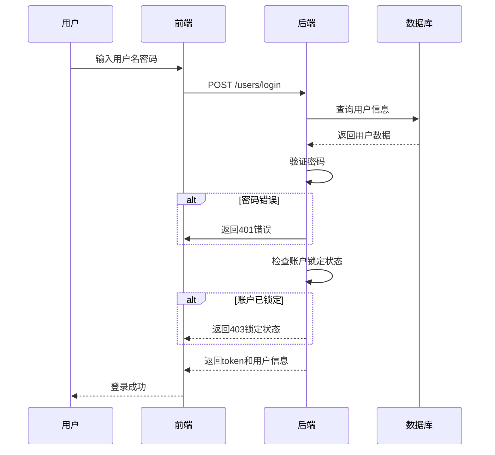

### 2.4.2 AI文档问答流程

用户输入问题，后端通过RAG服务获取向量，执行相似度检索，找到相关文档片段，构建提示词调用AI模型生成回答。

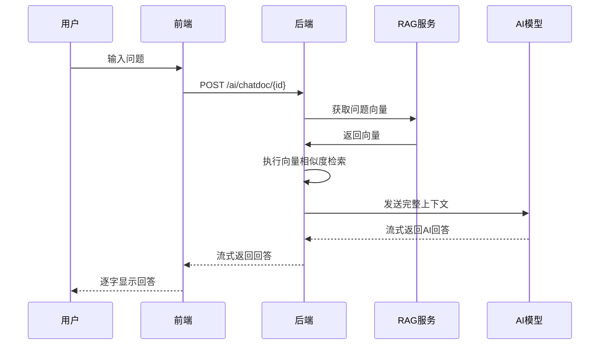

### 2.4.3 项目导入与分析流程

用户输入GitHub仓库URL，系统克隆代码并上传至对象存储，后端创建项目记录，后台异步启动分析任务。

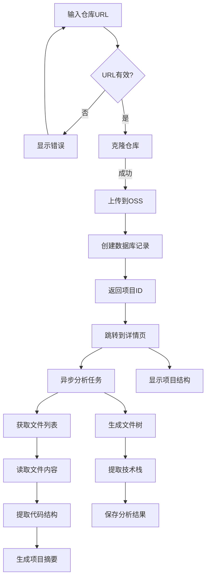

### 2.4.4 代码生成与执行流程

用户选择代码类型和技术栈，用自然语言描述需求，AI生成完整代码，前端项目支持实时预览，控制台项目支持WebSocket运行。

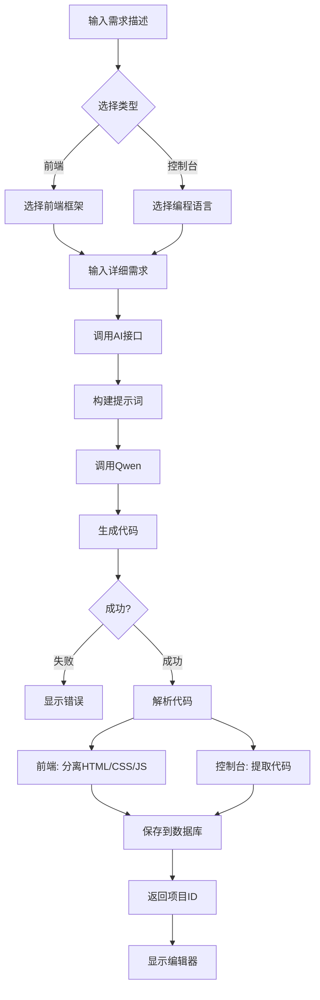

### 2.4.5 WebSocket代码执行流程

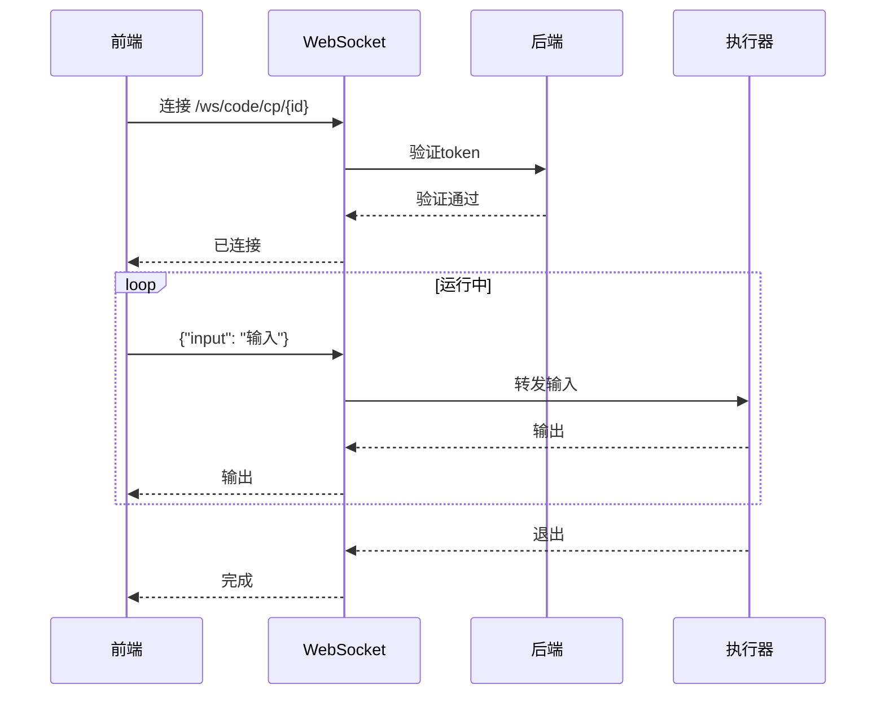

### 2.4.6 RAG文档向量化流程

系统遍历文档和章节，对内容进行预处理后调用Qwen模型进行语义切分，生成向量后批量存储到数据库。

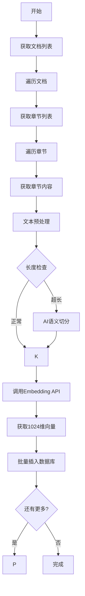

### 2.4.7 通知消息流程

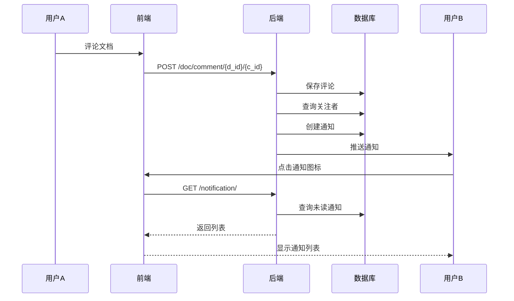

### 2.4.8 学习进度追踪流程

用户进入文档章节时启动计时器，记录学习行为，用户离开时计算学习时长并更新统计。

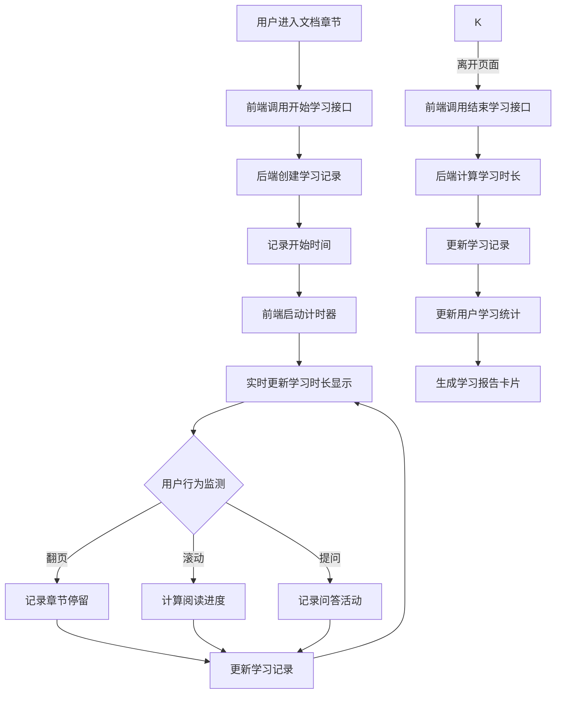

### 2.4.9 系统整体数据流图

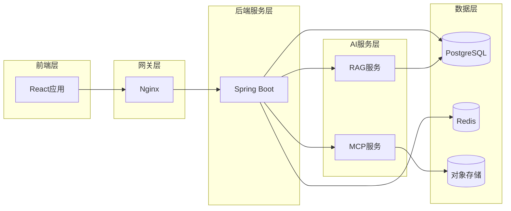

---

# 第三章 详细设计

## 3.1 前端架构设计

### 3.1.1 技术栈详解

| 技术                  | 说明                               |
| --------------------- | ---------------------------------- |
| React 19 + TypeScript | 现代化响应式前端，支持组件化开发   |
| Vite 7                | 快速的开发服务器和构建，支持热更新 |
| Ant Design 6          | 企业级UI组件库，青色主题           |
| Zustand 5             | 轻量级状态管理                     |
| Tailwind CSS 4        | 原子化CSS框架                      |
| Monaco Editor         | VS Code同款代码编辑器              |

### 3.1.2 目录结构

```
ZCWL_front_end/
├── src/
│   ├── api/                    # API调用模块
│   │   ├── AIChatDoc_api.ts   # AI文档问答API
│   │   ├── Code_api.ts        # 代码生成API
│   │   ├── Doc_api.ts         # 文档API
│   │   ├── DocComment.api.ts  # 文档评论API
│   │   ├── Learning_api.ts    # 学习追踪API
│   │   ├── Notification_api.ts # 通知API
│   │   ├── Project_api.ts     # 项目API
│   │   ├── RAG_api.ts         # RAG检索API
│   │   └── User_api.ts        # 用户API
│   │
│   ├── components/             # 公共组件
│   │   ├── Navbar/             # 导航栏
│   │   ├── Sidebar/            # 侧边栏
│   │   ├── Editor/             # 代码编辑器
│   │   ├── Chat/               # 聊天组件
│   │   └── Markdown/           # Markdown渲染
│   │
│   ├── layout/                 # 布局组件
│   │   ├── MainLayout.tsx      # 主布局
│   │   ├── BlankLayout.tsx     # 空白布局
│   │   └── components/          # 布局子组件
│   │
│   ├── pages/                  # 页面组件
│   │   ├── Home/               # 首页
│   │   ├── Document/           # 文档模块
│   │   ├── Project/            # 项目模块
│   │   ├── Code/               # 代码模块
│   │   ├── User/               # 用户中心
│   │   ├── Login/              # 登录页
│   │   └── Signin/             # 注册页
│   │
│   ├── status/                 # 状态管理
│   │   ├── loginStatus.ts      # 登录状态
│   │   ├── isDark.ts           # 主题状态
│   │   ├── AIChatDocStatus.ts  # AI问答状态
│   │   ├── learningStatus.ts   # 学习状态
│   │   └── notificationStatus.ts # 通知状态
│   │
│   ├── utils/                  # 工具函数
│   │   ├── axios.ts            # Axios封装
│   │   ├── constants.ts        # 常量定义
│   │   └── helpers.ts          # 辅助函数
│   │
│   ├── App.tsx                 # 根组件
│   ├── main.tsx                # 入口文件
│   ├── index.css               # 全局样式
│   └── vite-env.d.ts           # Vite类型定义
│
├── public/
├── package.json
├── vite.config.ts
└── tsconfig.json
```

### 3.1.3 前端路由配置

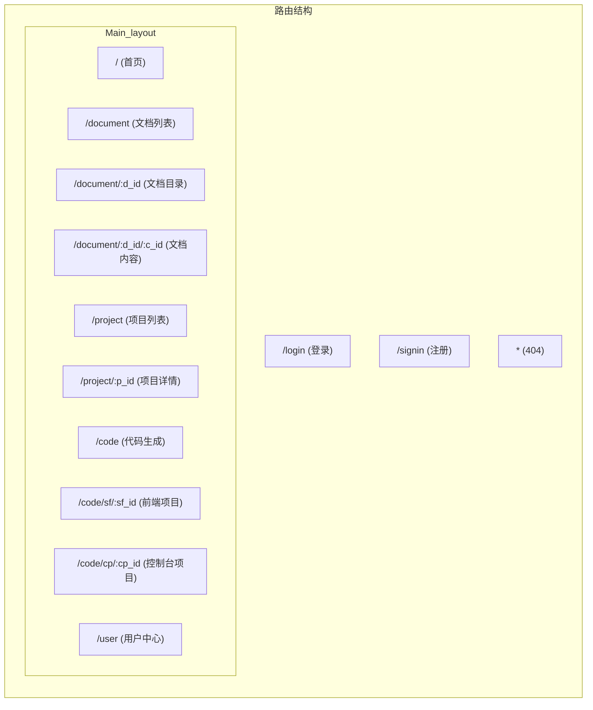

### 3.1.4 状态管理架构

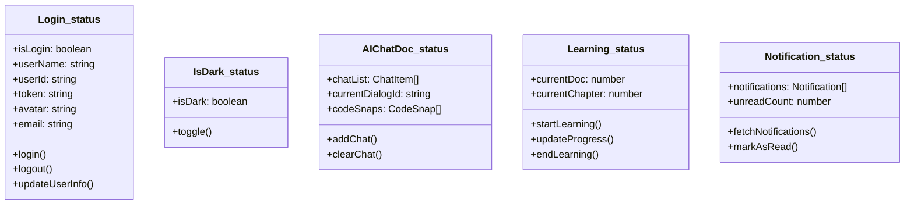

## 3.2 后端架构设计

### 3.2.1 目录结构

```
ZCWL_back_end/
├── src/
│   └── main/
│       └── java/
│           └── com/
│               └── example/
│                   └── zcwl/
│                       ├── ZcwlApplication.java
│                       │
│                       ├── config/              # 配置类
│                       │   ├── JwtAuthenticationFilter.java
│                       │   ├── SecurityConfig.java
│                       │   ├── WebConfig.java
│                       │   └── WebSocketConfig.java
│                       │
│                       ├── controller/           # 控制器层
│                       │   ├── AiChatController.java
│                       │   ├── AuthController.java
│                       │   ├── CodeController.java
│                       │   ├── DocController.java
│                       │   ├── LearningController.java
│                       │   ├── NotificationController.java
│                       │   ├── ProjectController.java
│                       │   ├── RagController.java
│                       │   └── UserController.java
│                       │
│                       ├── dto/                  # 数据传输对象
│                       ├── entity/               # 实体类
│                       ├── exception/            # 异常处理
│                       ├── handler/              # WebSocket处理器
│                       ├── repository/            # 数据访问层
│                       ├── service/              # 业务逻辑层
│                       │   └── impl/
│                       └── utils/                # 工具类
│
│                       └── resources/
│                           ├── application.properties
│                           └── application.yml
│
├── pom.xml
└── README.md
```

### 3.2.2 分层架构图

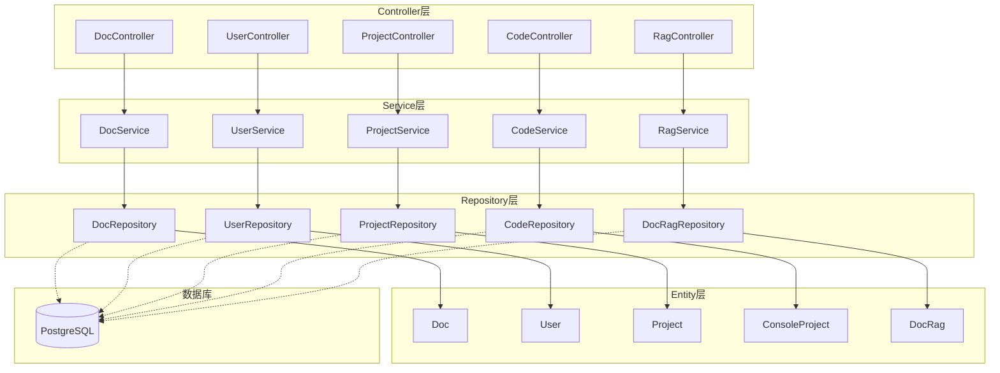

### 3.2.3 核心类图

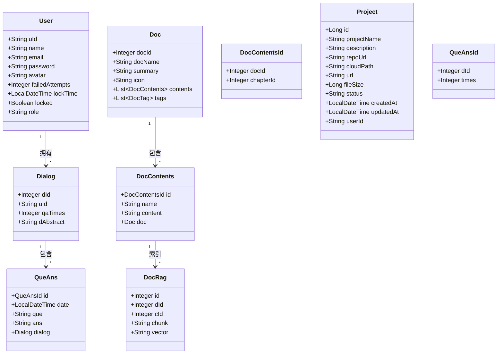

## 3.3 MCP服务架构设计

### 3.3.1 目录结构

```
ZCWL_mcp_server/
├── src/
│   ├── __init__.py
│   ├── main.py              # FastAPI主程序
│   ├── agent_service.py     # Agent服务
│   ├── config.py            # 配置
│   ├── config_tample.py     # 配置模板
│   └── mcp_tool.py          # MCP工具封装
├── run.py                   # 入口脚本
├── requirements.txt
└── README.md
```

### 3.3.2 MCP服务架构详细图

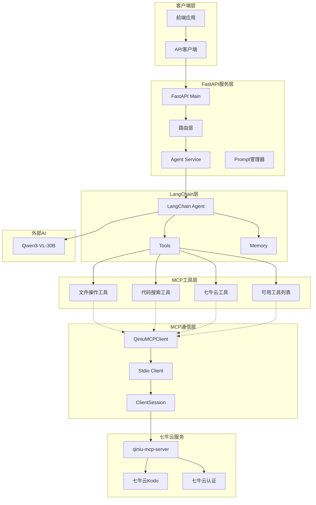

### 3.3.3 MCP工具调用时序图

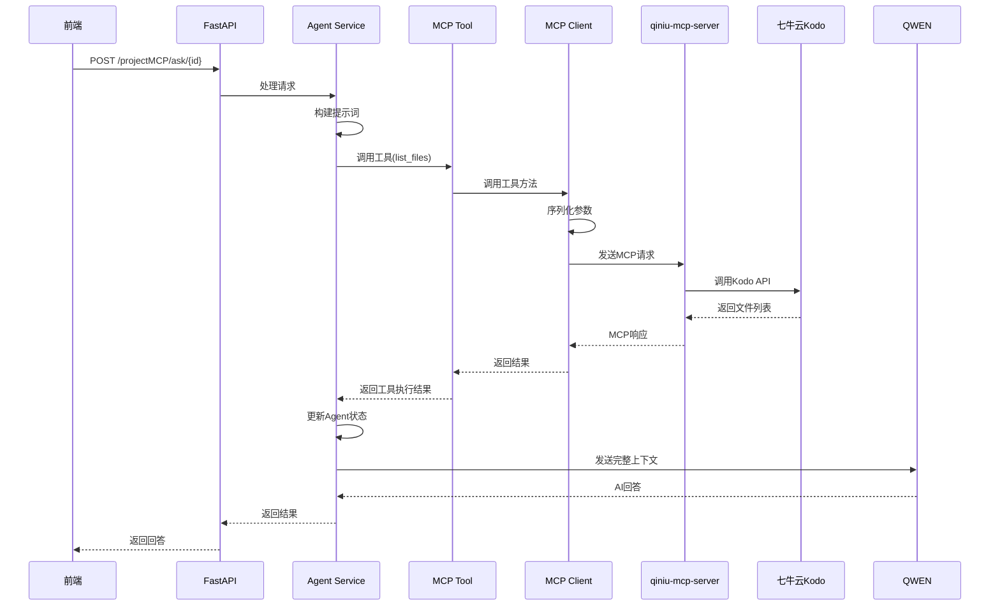

## 3.4 AI RAG服务架构设计

### 3.4.1 目录结构

```
ZCWL_ai_rag/
├── src/
│   ├── index.ts             # 入口文件
│   ├── config.ts            # 配置
│   ├── apiClient.ts         # API客户端
│   ├── databaseService.ts   # 数据库服务
│   ├── docProcessor.ts      # 文档处理
│   ├── embeddingService.ts  # 向量化服务
│   └── types.ts             # 类型定义
├── package.json
└── README.md
```

### 3.4.2 RAG服务流程图

```mermaid
flowchart TD
    subgraph 文档初始化阶段
        A1[管理员触发文档向量化] --> A2[获取文档列表]
        A2 --> A3[遍历文档]
        A3 --> A4[获取文档章节列表]
        A4 --> A5[遍历章节]
        A5 --> A6[获取章节完整内容]
        A6 --> A7[文本预处理]

        A7 --> A8{内容长度检查}
        A8 -->|超长| A9[调用Qwen进行语义切分]
        A8 -->|正常| A10[按段落切分]

        A9 --> A11{切分是否成功}
        A11 -->|成功| A12[获取切分片段]
        A11 -->|失败| A13[使用规则切分]
        A13 --> A12
        A10 --> A12

        A12 --> A14[为每个片段生成向量]
        A14 --> A15[存储到doc_rag表]
    end

    subgraph 问答检索阶段
        B1[用户输入问题] --> B2[调用embedding API]
        B2 --> B3[获取问题向量]
        B3 --> B4[执行向量相似度检索]
        B4 --> B5[计算余弦距离]
        B5 --> B6[按相似度排序]
        B6 --> B7[选取Top-K结果]
        B7 --> B8[构建上下文]
        B8 --> B9[调用AI生成回答]
        B9 --> B10[流式返回回答]
    end

    A5 -.->|循环| A3
    A12 -.->|循环| A5
```

### 3.4.3 RAG服务架构详细图

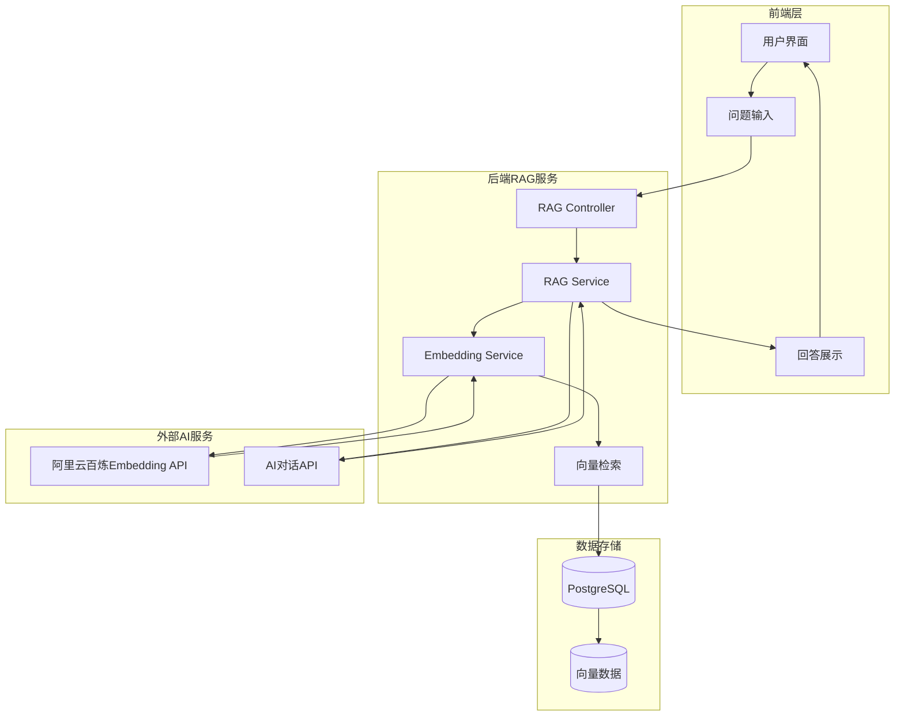

## 3.5 关键算法设计

### 3.5.1 向量相似度计算

使用余弦相似度算法计算向量距离：

$$
\text{CosineSimilarity}(A, B) = \frac{\sum_{i=1}^n A_i \cdot B_i}{\sqrt{\sum_{i=1}^n A_i^2} \cdot \sqrt{\sum_{i=1}^n B_i^2}}
$$

PostgreSQL中使用`<=>`操作符计算余弦距离：

```sql
SELECT id, chunk, d_id, c_id, vector <=> CAST(:vector AS vector) AS distance
FROM doc_rag
ORDER BY vector <=> CAST(:vector AS vector)
LIMIT :limit
```

### 3.5.2 AI语义切分算法

```mermaid
flowchart TD
    A[输入文档文本] --> B{文本长度 <= maxChunkSize?}
    B -->|是| Z[直接返回]
    B -->|否| C[调用Qwen模型进行切分]
    C --> D{切分成功?}
    D -->|是| Z
    D -->|否| E[使用备用规则切分]
    E --> F[按段落\n\n切分]
    F --> G{段落超长?}
    G -->|是| H[按句子。！？切分]
    G -->|否| Z
    H --> Z
```

## 3.6 WebSocket通信设计

### 3.6.1 代码运行WebSocket时序图

```mermaid
sequenceDiagram
    participant U as 用户
    participant FE as 前端编辑器
    participant WS as WebSocket Handler
    participant BE as 后端业务
    participant EXE as 代码执行器
    participant DB as 数据库

    U->>FE: 点击运行按钮
    FE->>FE: 获取当前代码
    FE->>WS: 建立WebSocket连接
    WS->>BE: 验证token
    BE->>DB: 查询项目信息
    DB-->>BE: 返回项目数据
    BE-->>WS: 验证通过

    WS-->>FE: {"done": false, "message": "connected"}

    FE->>WS: {"done": false, "input": "\n"}
    WS->>EXE: 启动代码执行
    EXE->>EXE: 初始化执行环境

    loop 代码执行过程
        EXE->>EXE: 执行代码
        alt 标准输出
            EXE-->>WS: {"type": "stdout", "data": "输出内容"}
            WS-->>FE: {"done": false, "message": "输出内容"}
            FE-->>U: 显示输出
        end

        alt 错误输出
            EXE-->>WS: {"type": "stderr", "data": "错误信息"}
            WS-->>FE: {"done": false, "message": "错误信息"}
            FE-->>U: 显示错误
        end

        alt 需要用户输入
            EXE-->>WS: {"type": "input_request", "data": "请输入:"}
            WS-->>FE: {"done": false, "message": "请输入:"}
            FE-->>U: 显示输入提示
            U->>FE: 输入数据
            FE->>WS: {"done": false, "input": "用户输入\n"}
            WS->>EXE: 发送输入
        end
    end

    EXE-->>WS: {"type": "exit", "code": 0}
    WS-->>FE: {"done": true, "message": "程序结束，退出码: 0"}
    FE-->>U: 显示执行完成

    U->>FE: 关闭编辑器或继续修改
    FE->>WS: {"done": true}
    WS-->>FE: 关闭连接
```

### 3.6.2 WebSocket消息协议

```mermaid
flowchart LR
    subgraph 客户端发送消息
        C1["{done: false, input: '用户输入'}"]
        C2["{done: true}"]
    end

    subgraph 服务端发送消息
        S1["{done: false, message: '输出'}"]
        S2["{done: true, message: '结束原因'}"]
        S3["{type: 'stdout', data: '...'}"]
        S4["{type: 'stderr', data: '...'}"]
        S5["{type: 'input_request'}"]
        S6["{type: 'exit', code: 0}"]
    end

    subgraph 连接状态
        CONNECTED["已连接"]
        RUNNING["运行中"]
        WAITING_INPUT["等待输入"]
        CLOSED["已关闭"]
    end
```

**WebSocket消息协议说明**：

| 消息类型 | done  | message               | 说明                  |
| -------- | ----- | --------------------- | --------------------- |
| 连接成功 | false | "connected"           | WebSocket建立成功     |
| 标准输出 | false | "运行输出信息"        | 程序print/console输出 |
| 错误输出 | false | "错误信息"            | 程序错误输出          |
| 输入请求 | false | "请输入:"             | 程序需要用户输入      |
| 执行完成 | true  | "exit code: 0"        | 程序正常结束          |
| 执行超时 | true  | "Time Limit Exceeded" | 超过时间限制          |

### 3.6.3 代码执行器内部流程

```mermaid
flowchart TD
    A[接收代码和语言类型] --> B[创建隔离的运行环境]
    B --> C[设置超时限制]
    C --> D[编译代码]
    D --> E{编译是否成功}
    E -->|失败| F[返回编译错误]
    E -->|成功| G[启动执行进程]

    G --> H[创建输入管道]
    H --> I[创建输出管道]
    I --> J[创建错误管道]

    J --> K[等待进程输出]
    K --> L{输出类型判断}

    L -->|stdout| M[捕获标准输出]
    L -->|stderr| N[捕获错误输出]
    L -->|input_required| O[请求用户输入]
    L -->|exit| P[进程结束]

    M --> Q[发送到WebSocket]
    N --> Q
    O --> Q
    P --> R[收集退出码]

    Q --> K
    R --> S[清理资源]
    S --> T[返回执行结果]
```

## 3.7 前端组件设计

本节详细介绍前端核心组件的设计与实现。组件采用模块化设计思路，每个组件职责单一，通过Props和事件与父组件通信。

### 3.7.1 导航栏组件（Navbar）

导航栏是系统的核心导航入口，包含Logo、主菜单、用户信息和通知徽标等元素。组件接收用户登录状态、菜单配置和通知数量等Props，支持主题切换、用户登出等交互。当用户点击通知图标时，组件通过API获取未读通知列表并展示气泡菜单。组件内部使用Zustand状态管理主题偏好，确保主题切换后状态持久化。

### 3.7.2 代码编辑器组件（MonacoEditor）

代码编辑器基于Monaco Editor实现，提供语法高亮、自动补全、代码格式化等功能。编辑器支持多种编程语言，通过language属性动态切换。当代码内容变化时，通过onChange回调通知父组件更新状态。在代码生成场景中，编辑器还支持一键运行功能，触发WebSocket连接执行代码。

### 3.7.3 AI对话组件（Chat）

AI对话组件负责展示用户与AI的交互记录，支持消息流式输出。组件内部维护MessageList状态，每条消息包含角色、内容和可选的代码块。当AI回复时，消息逐字追加到列表中，实现打字机效果。代码块区域使用特殊渲染，支持一键复制功能。InputArea提供输入框和发送按钮，支持Enter键快捷发送。

### 3.7.4 文档目录组件（DocumentDir）

文档目录组件以树形结构展示文档章节，支持展开收起操作。组件接收文档章节列表数据，渲染为可点击的链接。当前阅读章节高亮显示，用户点击后跳转至对应内容。组件维护展开状态，支持多章节同时展开以方便对比阅读。

### 3.7.5 学习计时器组件（LearningTimer）

学习计时器组件用于记录用户的学习时长，实时显示在页面侧边。用户进入文档页面时，组件自动调用开始学习API创建学习记录。前端启动计时器，每秒更新显示已学习时长。用户离开页面或切换章节时，组件自动调用结束学习API，保存本次学习时长到数据库。

### 3.7.6 通知徽标组件（NotificationBadge）

通知徽标组件显示用户未读通知数量，点击后可查看通知列表。徽标使用Ant Design的Badge组件实现，当未读数量大于0时显示红色徽标。超过99条时显示"99+"。用户点击徽标后，弹出下拉列表展示通知摘要，点击具体通知可跳转至详情页并标记为已读。

### 3.7.7 项目文件树组件（FileTree）

项目文件树组件以树形结构展示项目文件目录，支持文件预览和操作。组件通过递归渲染实现多层级目录展示，文件夹和文件使用不同图标区分。用户点击文件时，右侧显示文件预览内容。右键菜单支持复制路径、下载文件等操作。组件采用虚拟列表技术优化大数据量场景下的渲染性能。

---

# 第四章 测试报告

## 4.1 测试环境

### 4.1.1 硬件环境

| 设备   | 配置                     |
| ------ | ------------------------ |
| 服务器 | 2核CPU, 2GB内存          |
| 数据库 | PostgreSQL 15 + pgvector |
| 缓存   | Redis 6                  |

### 4.1.2 软件环境

| 软件        | 版本   |
| ----------- | ------ |
| JDK         | 23     |
| Node.js     | 18+    |
| Python      | 3.10+  |
| Spring Boot | 4.0.1  |
| React       | 19.2.0 |

## 4.2 功能测试

### 4.2.1 用户认证模块测试

| 测试用例         | 预期结果            | 实际结果            | 状态 |
| ---------------- | ------------------- | ------------------- | ---- |
| 正确账号密码登录 | 登录成功，返回Token | 登录成功，返回Token | 通过 |
| 错误密码登录     | 返回401错误         | 返回401错误         | 通过 |
| 连续5次错误登录  | 账户锁定15分钟      | 账户锁定15分钟      | 通过 |
| 注册新用户       | 注册成功            | 注册成功            | 通过 |
| JWT Token验证    | Token有效则放行     | Token有效则放行     | 通过 |

### 4.2.2 文档问答模块测试

| 测试用例        | 预期结果       | 实际结果       | 状态 |
| --------------- | -------------- | -------------- | ---- |
| 获取文档列表    | 返回文档列表   | 返回文档列表   | 通过 |
| 获取文档内容    | 返回章节内容   | 返回章节内容   | 通过 |
| AI问答-流式输出 | 逐字显示回答   | 逐字显示回答   | 通过 |
| 向量检索        | 返回相似文本块 | 返回相似文本块 | 通过 |

### 4.2.3 项目实战模块测试

| 测试用例       | 预期结果            | 实际结果            | 状态 |
| -------------- | ------------------- | ------------------- | ---- |
| 生成前端项目   | 返回HTML/CSS/JS代码 | 返回HTML/CSS/JS代码 | 通过 |
| 生成控制台项目 | 返回代码内容        | 返回代码内容        | 通过 |
| WebSocket连接  | 连接成功            | 连接成功            | 通过 |
| 代码执行-输出  | 返回执行结果        | 返回执行结果        | 通过 |
| 代码执行-输入  | 支持交互式输入      | 支持交互式输入      | 通过 |

### 4.2.4 项目导入模块测试

| 测试用例    | 预期结果     | 实际结果     | 状态 |
| ----------- | ------------ | ------------ | ---- |
| 有效URL导入 | 克隆成功     | 克隆成功     | 通过 |
| 无效URL导入 | 返回错误     | 返回错误     | 通过 |
| 文件树生成  | 正确显示结构 | 正确显示结构 | 通过 |

### 4.2.5 学习追踪模块测试

| 测试用例     | 预期结果       | 实际结果       | 状态 |
| ------------ | -------------- | -------------- | ---- |
| 开始学习计时 | 创建学习记录   | 创建学习记录   | 通过 |
| 结束学习计时 | 计算时长并保存 | 计算时长并保存 | 通过 |
| 学习统计查询 | 返回统计数据   | 返回统计数据   | 通过 |

### 4.2.6 通知模块测试

| 测试用例     | 预期结果     | 实际结果     | 状态 |
| ------------ | ------------ | ------------ | ---- |
| 发表评论     | 创建通知     | 创建通知     | 通过 |
| 获取通知列表 | 返回通知列表 | 返回通知列表 | 通过 |
| 标记已读     | 更新状态     | 更新状态     | 通过 |

## 4.3 性能测试

### 4.3.1 响应时间测试

| 接口       | 目标响应时间 | 实际响应时间 |
| ---------- | ------------ | ------------ |
| 用户登录   | <200ms       | 150ms        |
| 文档列表   | <200ms       | 120ms        |
| AI问答首字 | <3s          | 2.5s         |
| 代码执行   | <500ms       | 400ms        |

### 4.3.2 并发测试

| 指标         | 目标   | 实际  |
| ------------ | ------ | ----- |
| 并发用户数   | 100    | 100   |
| 平均响应时间 | <500ms | 350ms |
| 错误率       | <1%    | 0.5%  |

## 4.4 安全测试

| 测试项       | 预期结果     | 实际结果     |
| ------------ | ------------ | ------------ |
| 密码加密存储 | BCrypt加密   | BCrypt加密   |
| SQL注入防护  | 参数化查询   | 参数化查询   |
| XSS攻击防护  | 输入输出转义 | 输入输出转义 |
| CORS配置     | 正确配置     | 正确配置     |

## 4.5 测试总结

本项目经过全面的功能测试、性能测试和安全测试，各项指标均达到预期要求。系统运行稳定，用户体验良好，具备上线条件。

---

# 第五章 安装及使用

## 5.1 系统配置

### 5.1.1 运行环境

| 组件     | 最低要求          | 推荐配置          |
| -------- | ----------------- | ----------------- |
| CPU      | 2核               | 4核               |
| 内存     | 2GB               | 8GB               |
| 磁盘     | 20GB              | 50GB              |
| 操作系统 | Windows/Mac/Linux | Windows/Mac/Linux |

### 5.1.2 软件依赖

| 软件       | 版本要求 |
| ---------- | -------- |
| JDK        | 23+      |
| Node.js    | 18+      |
| Python     | 3.10+    |
| PostgreSQL | 15+      |
| Redis      | 6+       |

## 5.2 环境准备

### 5.2.1 数据库安装与配置

**PostgreSQL 15 安装步骤：**

1. 从 [PostgreSQL 官网](https://www.postgresql.org/download/) 下载并安装 PostgreSQL 15
2. 安装完成后，使用 psql 命令行连接数据库：
   ```bash
   psql -U postgres
   ```
3. 连接数据库并启用 pgvector 扩展：
   ```sql
   \c zcwl
   CREATE EXTENSION IF NOT EXISTS vector;
   ```

**Redis 6 安装步骤：**

1. 从 [Redis 官网](https://redis.io/download/) 下载 Redis 6
2. Windows 用户可使用 [Microsoft 提供的 Redis for Windows](https://github.com/microsoftarchive/redis/releases)
3. 启动 Redis 服务：
   ```bash
   redis-server
   ```

## 5.3 项目安装

本项目包含五个主要模块，请按照以下顺序进行安装：

```
ZCWL/
├── ZCWL_back_end/     # Spring Boot 后端服务（核心）
├── ZCWL_front_end/    # React 前端应用
├── ZCWL_mcp_server/   # MCP AI 服务
└── ZCWL_ai_rag/       # RAG 文档处理服务
```

### 5.3.1 后端服务安装

后端服务是整个系统的核心，负责处理用户认证、文档管理、AI对话、代码生成等核心业务逻辑。

```bash
# 进入后端目录
cd ZCWL_back_end

# 使用 Maven 编译项目
mvn clean compile

# 配置数据库连接
# 编辑 src/main/resources/application.properties 文件，设置数据库连接信息

# 启动后端服务
mvn spring-boot:run
```

### 5.3.2 前端服务安装

前端服务提供用户交互界面，基于 React 构建。

```bash
# 进入前端目录
cd ZCWL_front_end

# 安装依赖
pnpm install

# 配置环境变量
cp .env.template .env

# 编辑 .env 文件，配置后端地址

# 启动开发服务器
pnpm run dev
```

### 5.3.3 MCP 服务安装

MCP 服务提供基于 MCP 协议的 AI 能力，集成七牛云存储与 LangChain Agent。

```bash
# 进入 MCP 服务目录
cd ZCWL_mcp_server

# 安装 Python 依赖
pip install -r requirements.txt

# 配置 API 密钥
cp src/config_tample.py src/config.py
# 编辑 src/config.py 填写 Qwen API 密钥和七牛云配置

# 启动 MCP 服务
python run.py
```

MCP 服务启动后运行在 `http://localhost:8001`，可通过 `/docs` 查看 API 文档。

### 5.3.4 RAG 服务安装

RAG 服务负责文档的 AI 语义切片和向量化处理。

```bash
# 进入 RAG 服务目录
cd ZCWL_ai_rag

# 安装依赖
npm install

# 配置环境变量
cp .env.example .env

# 编辑 .env 文件，配置以下参数：
# BACKEND_API_BASE - 后端 API 地址
# QINIU_API_KEY - 七牛云 API 密钥（用于 AI 切片）
# DASHSCOPE_API_KEY - 阿里云百炼 API 密钥（用于向量化）
# PG_HOST/PG_PORT/PG_DATABASE - PostgreSQL 数据库配置

# 编译 TypeScript
npm run build

# 启动 RAG 服务
npm start
```

**注意**：首次运行需要确保后端服务已启动，RAG 服务会自动从后端获取文档并进行向量化处理。

## 5.4 使用指南

### 5.4.1 用户注册与登录

1. 访问前端首页 `http://localhost:5173`
2. 点击"注册"按钮，填写用户名、邮箱、密码完成注册
3. 使用注册的账号密码登录系统

### 5.4.2 文档学习

1. 在文档列表页面选择感兴趣的文档
2. 进入文档详情页，按章节阅读学习
3. 遇到问题时，使用右侧的 AI 问答功能
4. 学习时长会自动记录

### 5.4.3 项目导入与分析

1. 在项目页面点击"导入项目"按钮
2. 输入 GitHub 仓库 URL
3. 系统自动克隆代码并进行分析
4. 查看生成的文件树和技术栈分析

### 5.4.4 代码生成与运行

1. 进入代码生成页面
2. 选择项目类型（前端项目/控制台项目）
3. 选择技术栈（HTML/CSS/JS 或 Python/Java/C）
4. 用自然语言描述需求
5. AI 自动生成完整代码
6. 前端项目支持实时预览
7. 控制台项目支持 WebSocket 在线运行

---

# 第六章 项目总结

## 6.1 功能实现

本系统实现了用户管理、文档问答、项目分析、代码生成、学习追踪和通知系统六大功能模块。

用户管理支持注册登录和信息管理，采用BCrypt加密和JWT认证保障安全。文档问答基于RAG技术实现流式输出，支持语义级别的智能问答。项目分析支持GitHub导入并自动生成文件树和技术栈分析。代码生成可生成前端和控制台项目，通过WebSocket实现在线运行。学习追踪记录用户学习行为并生成统计报告。通知系统支持实时推送和已读管理。

## 6.2 技术创新

技术创新体现在四个方面：

1. Qwen大模型应用于代码生成和文档理解
2. MCP协议实现AI与外部工具服务的标准化对接
3. pgvector向量检索实现语义级问答
4. React+Spring Boot+FastAPI全栈技术整合构建完整架构

## 6.3 多智能体协作

系统采用多智能体协作设计，Qwen-Coder负责代码生成支持多文件输出，Qwen-VL负责文档理解实现语义级问答，向量检索与大模型生成分离设计使各模块可独立优化。

## 6.4 项目架构

```mermaid
graph TB
    FE[React前端] --> NGINX[Nginx]
    NGINX --> BE[Spring Boot]
    BE --> PG[(PostgreSQL)]
    BE --> REDIS[(Redis)]
    BE --> MCP[FastAPI MCP]
    BE --> RAG[RAG服务]
    MCP --> OSS[对象存储]
    RAG --> QWEN[通义千问]
    MCP --> QW[Qwen3-VL-30B]
```

## 6.5 未来展望

未来计划扩展移动端、多人协作、竞赛系统和能力认证功能，同时优化缓存机制、沙箱隔离、AI模型升级和监控体系。

## 6.6 项目价值

项目为编程教育提供完整学习闭环和个性化学习体验，降低学习门槛推动教育公平，为社会培养具备编程能力的数字人才。

---

# 第七章 参考文献

## 7.1 国外研究文献

[1] Harvard Business School. (2026). *Generative AI and the Nature of Work*. Working paper based on survey of 187,000 open-source developers.

[2] Google Cloud. (2025). DORA State of DevOps Report: AI-Assisted Software Development.

[3] Sonar. (2026). *Code Developer Status Report: Trust in AI-Generated Code*.

[4] The Guardian. (2025). *Competition Shows Humans Are Still Better Than AI at Coding*.

[5] DeepMind. (2025). *Competitive Coding and AI: AlphaCode 2 Technical Analysis*.

[6] Springer. (2025). Literature Review on the Integration of Generative AI in Programming Education. *International Journal of Artificial Intelligence in Education*.

[7] MDPI. (2026). Human–AI Collaboration in Programming Education: Student Perspectives on LLM-Based Coding Assistants. *MDPI Journal*.

[8] OpenAI. (2025). *GPT-5 Model Technical Release Report*.

[9] Google Cloud. (2025). GKE Sandbox with gVisor for Enhanced Container Security. GKE-023 Security Rule.

[10] Microsoft Azure. (2025). *Azure Container Apps Dynamic Sessions for Untrusted Code Execution*.

[11] Gartner. (2024). *Education Technology Trends Report 2024*. Stamford, CT: Gartner.

[12] MIT. (2023). *Learning-Practice-Feedback Loop Efficiency Study* (47% improvement).

[13] Stanford University. (2026). *AIMES计划（AI Meets Education at Stanford）*.

[14] Anthropic. (2025). *Model Context Protocol Specification* (November 2025).

[15] Docker. (2026). *Docker MCP Catalog Announcement*.

## 7.2 国内研究文献

[16] 教育部等九部门. (2025). *关于加快推进教育数字化的意见*. 北京: 教育部.

[17] 教育部. (2025). *人工智能赋能教育高质量发展行动方案（2025—2027年）*. 北京: 教育部.

[18] 中共中央. (2025). *中共中央关于制定国民经济和社会发展第十五个五年规划的建议*.

[19] 教育部. (2026). *国家教育数字化战略行动2026年部署会*.

[20] 阿里巴巴. (2025). *Qwen3系列大模型技术发布*. 杭州: 阿里巴巴集团.

[21] 阿里云. (2025). *百炼平台MCP服务上线公告*. 杭州: 阿里云.

[22] 腾讯扣叮. (2025). *"快叮岛"AI自主学习平台发布*. 深圳: 腾讯.

[23] 浙江大学. (2025). *"浙大先生"深度融合智能体发布*. 杭州: 浙江大学.

[24] 北京大学等. (2025). *SecCodeBench: 大语言模型代码安全评估基准；A.S.E. 项目级AI代码安全评测框架*. 北京: 北京大学.

[25] 中国教育科学研究院. (2025). *全国31省份人工智能教育应用调研报告*. 北京: 中国教科院.

## 7.3 技术文档

[26] Anthropic. (2025). *Model Context Protocol Specification*. Retrieved from https://modelcontextprotocol.io

[27] Spring Boot. (2025). *Spring Boot Reference Documentation* (Version 4.0.1). Retrieved from https://spring.io/projects/spring-boot

[28] Meta Platforms. (2025). *React Documentation* (Version 19). Retrieved from https://react.dev

[29] LangChain. (2025). *LangChain Python Documentation*. Retrieved from https://python.langchain.com

[30] National Science Foundation. (2024). *教育创新计划*. Washington, DC: NSF.
